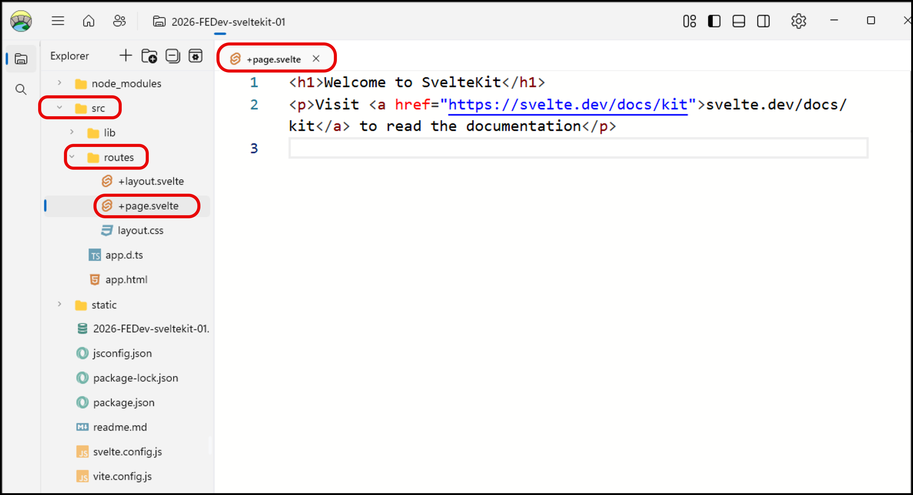
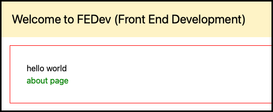
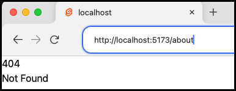
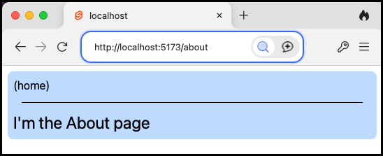

# 2026-FEDev-sveltekit-01

a first Sveltekit + TailWindCSS project from scratch

## how to create this project from scratch

1. Create directory for project

    ```bash
    >>> mkdir svelte01
    ```

1. cd into directory

    ```bash
    >>> cd svelte01
    ```

1. Initialise directory as a SvelteKit project:

   we'll use `npx sv` the Svelte command line tool:

  ```bash
    >>> npx sv create 
  ```

   - we'll create it in the current directory
     - `(hit Enter to use './')`
   - choose **SvelteKit minimal**
     -  `● SvelteKit minimal (barebones scaffolding for your new app)`
   - choose JavaScript with JSDoc comments (**Not TypeScript** unless you know TypeScript of course...)
     - ` ● Yes, using JavaScript with JSDoc comments`
   - add TailWindCSS to the project
     - ` ◼ tailwindcss (css framework - https://tailwindcss.com)`
   - add both TailWindCSS **typography** and **forms** 
     - `◼ typography (@tailwindcss/typography)`
     - `◼ forms (@tailwindcss/forms)`
   - choose to add dependencies with **npm**
     - `● npm`

    NOTE:
    - You'll see that all the above options could be written in a single line, to save time in the future:
        ```bash
         npx sv create --template minimal --types jsdoc --add tailwindcss="plugins:typography,forms" --install npm ./
        ```
    Here's the full output from these interactions at the terminal:

   ```bash
    >>> npx sv create 
    
    ┌  Welcome to the Svelte CLI! (v0.11.3)
    │
    ◇  Where would you like your project to be created?
    │  ./
    │
    ◇  Which template would you like?
    │  SvelteKit minimal
    │
    ◇  Add type checking with TypeScript?
    │  Yes, using JavaScript with JSDoc comments
    │
    ◇  What would you like to add to your project? (use arrow keys / space bar)
    │  tailwindcss
    │
    ◇  Which plugins would you like to add?
    │  typography, forms
    │
    ◆  Project created
    │
    ◆  Successfully setup add-ons: tailwindcss
    │
    ◇  Which package manager do you want to install dependencies with?
    │  npm
    │
    ●  Re-run without prompts:
    │  npx sv create --template minimal --types jsdoc --add tailwindcss="plugins:typography,forms" --install npm ./
    │
    │
    ◆  Successfully installed dependencies with npm
    │
    ◇  What's next? ───────────────────────────────╮
    │  📁 Project steps                            │
    │                                              │
    │    1: npm run dev -- --open                  │
    ├──────────────────────────────────────────────╯
    │
    └  You're all set!
   ```

1. Let's do what it says! Run the web server

    ```bash
   npm run dev -- --open  
    ```
   
    - The `--open` option should automatically open your system default Web Browser to ` http://localhost:5173/`.
    - But if that doesn't happen, then CTRL-click the URL in the terminal to open a page in the system default browser

1. You also may with to look inside the README.md 

1. You should see something like the following:

    

1. This content comes from `/src/routes/+page.svelte`

   

1. Let's replace the content of `` with our own content

    - first a `<script>` to delcare a module name variable
    ```html
    <script>
        const moduleName = 'FEDev (Front End Development)';
    </script>
    ```
   
    - next some HTML elements
    ```html
    <h1 class="bg-amber-100 p-5 text-2xl">
        Welcome to {moduleName}
    </h1>
    
    <p>
        hello world
        <br>
        <a href="/about">about page</a>
    </p>
    ```
   
    - finally a `<style>`, which is local to this page
    ```html
    <style>
        p {
            margin: 1rem;
            padding: 2rem;
            border: solid red 1px;
        }
    
        a {
            color: green;
        }
    </style>
    ```
   
    - here it is altogether:

    ```html
    <script>
        const moduleName = 'FEDev (Front End Development)';
    </script>
    
    <h1 class="bg-amber-100 p-5 text-2xl">
        Welcome to {moduleName}
    </h1>
    
    <p>
        hello world
        <br>
        <a href="/about">about page</a>
    </p>
    
    <style>
        p {
            margin: 1rem;
            padding: 2rem;
            border: solid red 1px;
        }
    
        a {
            color: green;
        }
    </style>
    ```
   
1. The page should automatically refresh within a few seconds, and look as follows:

   

1. You'll have noticed we added a link to `/about`. 

    But if we click it, we'll get a 404 Not Found Error page, since we've not created that page yet...

   

1. Let's create this about page.

    - SvelteKit routing can be as simple as creating a subdirectory inside `/src/routes` for each page

    - create folder `/src/routes/about`

    - create file `/src/routes/about/+page.svelte` to contain the following:

    ```html
    <h1 class="bg-amber-100 p-5 text-2xl">
        Welcome to {moduleName}
    </h1>
    
    <p>
        hello world
        <br>
        <a href="/about">about page</a>
    </p>
    ```

1. Now when you visit the about page link from the home page you should see the following:

   


## Next steps

Start learning more about Svelte at:
- https://svelte.dev/

Above we've seen standard CSS in our `.svelte` pages, and also TailWindCSS styling in the `class=""` attributes of some HTML elements. If you put a little time into learning TailWindCSS, it can make element styling much faster, and there are nice examples you can copy and paste

   - TailWindCSS is an 'offical' plugin for Svelte. Learn more about TailWindCSS at
     - https://tailwindcss.com/


